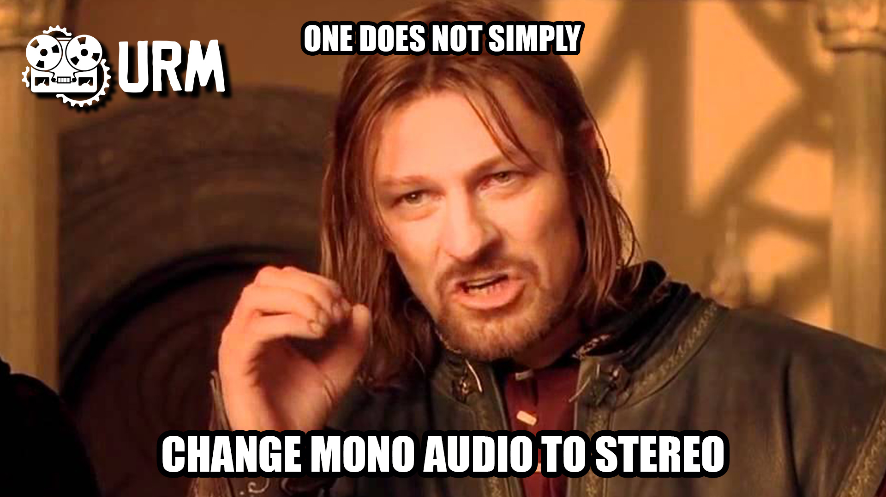

[](https://github.com/vberthiaume/dupe/actions/workflows/build_and_test.yml)
[](https://www.gnu.org/licenses/agpl-3.0)

# Dupe: mono-to-stereo widener



A JUCE audio plugin that turns a mono source (typically a guitar or vocal) into a wide stereo image while staying perfectly mono-compatible. Two micro pitch-shifters detune the input by ±`Pitch` cents; their decorrelated difference forms a pure side signal, while the dry input stays as the mid. The output is constructed as `L = dry + width·side`, `R = dry − width·side`, so summing `(L+R)/2` collapses back to the dry signal exactly: no comb filtering, no level drop, no chorusing on mono. An optional Haas-style precedence delay on one of the wet branches broadens the image further without breaking mono compatibility.

Parameters: `Pitch` (0–40 cents, default 7), `Mix` (0–1, default 1.0; scales the side gain up to 4× internally), `Haas` (0–30 ms, default 0), `Mono Listen` (sums output to mono in-plugin, useful for verifying mono compatibility).

Built on the [Starty](https://github.com/vberthiaume/starty) template, which itself derives from [Pamplejuce](https://github.com/sudara/pamplejuce).

## Install dependencies
### macOS
```bash
brew install cmake ninja clang-format          # Homebrew: https://brew.sh
```

### Linux (Ubuntu / Debian)
```bash
sudo apt update
sudo apt install -y \
  cmake ninja-build clang clang-format lld \
  libasound2-dev libx11-dev libxinerama-dev libxext-dev \
  libfreetype6-dev libwebkit2gtk-4.1-dev libglu1-mesa-dev
```

### Windows
- **[CMake](https://cmake.org/download/)** (add to PATH during install).
- **[Ninja](https://github.com/ninja-build/ninja/releases)** on PATH (or `choco install ninja`).

## Install the pre-commit hook
One-time, per clone. Refuses commits whose staged C/C++ files aren't clang-format clean (see `.githooks/pre-commit`):

```bash
git config core.hooksPath .githooks
```

## Build (and run tests)
```bash
cmake -B Builds -G Ninja -DCMAKE_BUILD_TYPE=Debug -DCMAKE_EXPORT_COMPILE_COMMANDS=ON
cmake --build Builds
ctest --test-dir Builds --output-on-failure
```

For a universal macOS binary, add `-DCMAKE_OSX_ARCHITECTURES="arm64;x86_64"` to the configure step.

## Run RTSan locally (macOS)
CI runs RealtimeSanitizer on Linux. To check locally on macOS, install Homebrew LLVM, since Apple Clang doesn't ship the RTSan runtime:
```bash
brew install llvm
```

Configure a separate build dir using brew's clang and the realtime flags:
```bash
CC=/opt/homebrew/opt/llvm/bin/clang \
CXX=/opt/homebrew/opt/llvm/bin/clang++ \
cmake -B Builds-rtsan -G Ninja \
  -DCMAKE_BUILD_TYPE=Release \
  -DCMAKE_C_FLAGS="-fsanitize=realtime" \
  -DCMAKE_CXX_FLAGS="-fsanitize=realtime" \
  -DCMAKE_EXE_LINKER_FLAGS="-fsanitize=realtime"
```

Build and run:
```bash
cmake --build Builds-rtsan --target Tests
ctest --test-dir Builds-rtsan --output-on-failure --verbose -E NOT_BUILT
```

## CI
Every push and PR triggers:
- `build_and_test`: Linux/macOS/Windows, `pluginval` validation, artifact upload
- `instrumented_tests`: ASan / UBSan / TSan / RTSan (clang-20 for the latter), plus a Coverage report (gcovr → HTML artifact + step-summary numbers)
- `clang-tidy`: posts review comments on PRs

`nightly.yml` is wired up but its `schedule:` block is currently commented out, since push-driven CI is enough while development is active. Re-enable the cron in that file once the project is in maintenance mode and external drift (JUCE on `develop`, apt packages, runner images) becomes the main breakage risk.

## Releasing
Releases are tag-driven. The `release` job in `build_and_test.yml` is gated on `contains(github.ref, 'tags/v')` and uses `softprops/action-gh-release` to publish build artifacts (`.exe`, `.zip`, `.pkg`) as a GitHub prerelease.

To cut a release:

1. Update the `VERSION` file in the repo root (e.g. `0.1.0`). `PamplejuceVersion.cmake` can auto-bump the patch level, but for a real release set the version explicitly.
2. Commit and push to `main`.
3. Tag the commit with a `v`-prefixed tag matching the version, then push the tag:
   ```bash
   git tag v0.1.0
   git push origin v0.1.0
   ```
4. CI runs the full matrix on the tag, then the `release` job picks up the artifacts and publishes a draft prerelease on GitHub. Open the Releases page, fill in the description, flip the prerelease flag off if it's a real release, and publish.

The `v` prefix is required; a bare `0.1.0` tag won't trigger the release job.

## License
Dupe is released under the [GNU Affero General Public License, version 3](LICENSE) (AGPLv3). Copyright (C) 2026 Vincent Berthiaume.

This project links against [JUCE](https://juce.com/), used under the AGPLv3 free-use option of JUCE Ltd's dual-license terms.

### Third-party attribution
The "One Does Not Simply" meme variant at the top of this README is from [URM Academy](https://urm.academy/).

Portions of the build system and project scaffolding derive from the [Pamplejuce](https://github.com/sudara/pamplejuce) template, which is distributed under the MIT License:

> MIT License
>
> Copyright (c) 2022 Sudara Williams
>
> Permission is hereby granted, free of charge, to any person obtaining a copy of this software and associated documentation files (the "Software"), to deal in the Software without restriction, including without limitation the rights to use, copy, modify, merge, publish, distribute, sublicense, and/or sell copies of the Software, and to permit persons to whom the Software is furnished to do so, subject to the following conditions:
>
> The above copyright notice and this permission notice shall be included in all copies or substantial portions of the Software.
>
> THE SOFTWARE IS PROVIDED "AS IS", WITHOUT WARRANTY OF ANY KIND, EXPRESS OR IMPLIED, INCLUDING BUT NOT LIMITED TO THE WARRANTIES OF MERCHANTABILITY, FITNESS FOR A PARTICULAR PURPOSE AND NONINFRINGEMENT. IN NO EVENT SHALL THE AUTHORS OR COPYRIGHT HOLDERS BE LIABLE FOR ANY CLAIM, DAMAGES OR OTHER LIABILITY, WHETHER IN AN ACTION OF CONTRACT, TORT OR OTHERWISE, ARISING FROM, OUT OF OR IN CONNECTION WITH THE SOFTWARE OR THE USE OR OTHER DEALINGS IN THE SOFTWARE.
